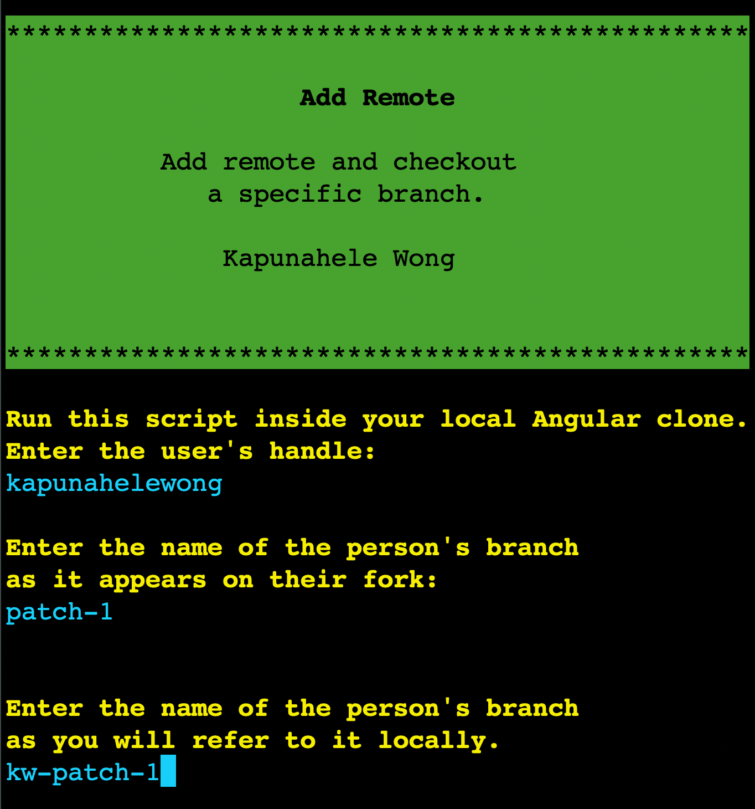

# Add Remote

This script helps you create a remote to a contributor's fork of the Angular repo, fetches the person's work, and checks out a new branch for you.

## How to use this script:

1. Download this repo.
  **Important:** Store this directory at the same level as the Angular directory, **not within your Angular clone**.
1. Go to terminal into the `add-remote` directory.
1. Type `chmod +x add-remote.sh`
1. Go back into your Angular directory.
1. To run the script, type `../add-remote/add-remote.sh`

### Add Remote prompts you for three things:

1. The user's GitHub handle.
  For example, mine is `kapunahelewong`.
1. The name of the person's branch as it appears on their fork.
  For example, in this URL: `https://github.com/kapunahelewong/angular/tree/patch-1`, my branch name is `patch-1`.
  You can see this in their PR under the PR title; for example, `kapunahelewong:patch-1`.
1. What you plan on calling this branch on your computer.
  Since `patch-1` is a common branch name, you might like to refer to it in a way that differentiates it from other `patch-1` branches.
  While you could call it `patch-1`, You could also call it something different such as `kw-patch-1` or `kapunahele-patch-1`.

  

### Get your changes up to GitHub

When you're done editing, amending a commit, or rebasing use `git push` to update the PR.
If you have used a unique name for the local version of the branch, git will give you an option of two commands.
Use the first command which is as follows:

```bash
git push <user handle> HEAD:<real branch name on github>
```

